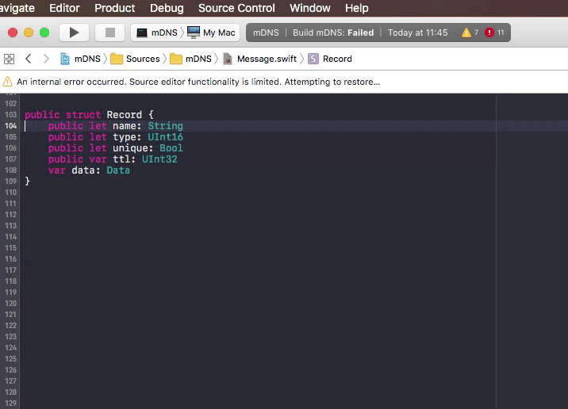

Swift Initializer Generator
===========================

This Xcode 8 Source Code Extension will generate a Swift initializer based on the lines you've selected. Handy if you made a struct public and now you have to provide the initializer implementation yourself.

Usage
-----

Select the lines with the attributes that should be included in the initializer. See below; ``>`` is the start of the selection and ``<`` is the end of the selection.

    struct MyStruct {
    >    public var a: String
        public var b: Int<
    }

Run the extension's "Generate Swift Initializer". Voila! The code above is modified to:

    struct MyStruct {
        public var a: String
        public var b: Int
        public init(a: String, b: String) {
            self.a = a
            self.b = b
        }
    }

Installation
------------

1. Open ``SwiftInitializerGenerator.xcodeproj``
2. Enable target signing for both the Application and the Source Code Extension using your own developer ID
3. Product > Archive
4. Right click archive > Show in Finder
5. Right click archive > Show Package Contents
6. Open Products, Applications
7. Drag ``Swift Initializer Generator.app`` to your Applications folder
8. Run ``Swift Initializer Generator.app`` and exit again.
9. The menu-item should now be available from Xcode's Editor menu.

Known limitations
-----------------

It will only parse attributes defined like ``(public|internal) (var|let) NAME: TYPE``.
